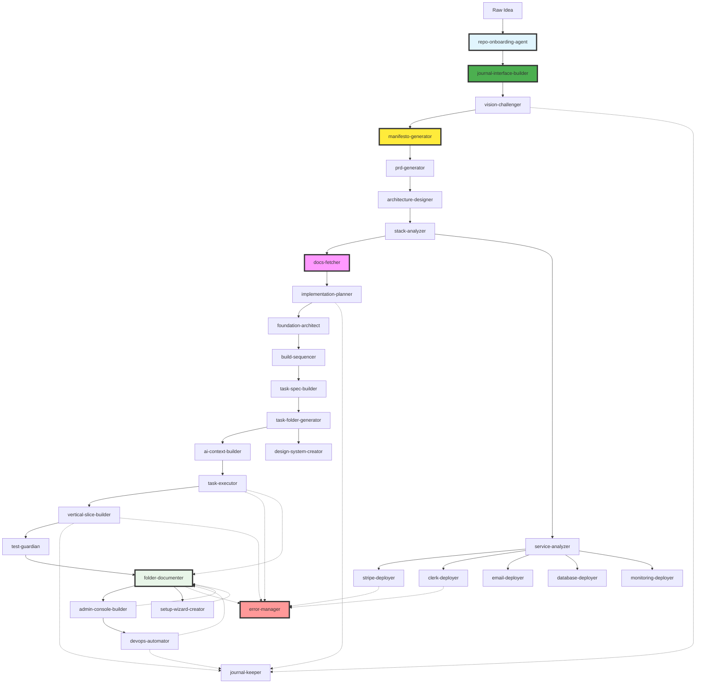

# Claude Code Agent System

## From Concept to Production in Agents

### Overview

A suite of specialized Claude Code agents that transform raw ideas into production-ready systems, following the exact pathway we discovered building Edition.

---

## Phase 0: Infrastructure Agents

### 0. `repo-onboarding-agent`

**Purpose**: Universal repository analysis and agent system integration
**Triggers**: Manual invocation on existing repositories (Pre-Phase 0)
**Capabilities**:

- Deep repository analysis (file structure, tech stack, patterns)
- Agent system integration without disruption
- Creates AGENT_COMPATIBILITY_MAP.md for repo-specific guidelines
- Sets up agent infrastructure respecting existing patterns
- Generates project manifesto based on discovered patterns
- Outputs: Complete agent system integration for any repository

### 1. `journal-interface-builder`

**Purpose**: Create human-readable dashboard for monitoring agents
**Triggers**: FIRST agent to run, before anything else
**Capabilities**:

- Creates project-dashboard directory structure
- Generates HTML dashboard interface
- Sets up journal logging system
- Creates status tracking files
- Implements auto-refresh mechanism
- Outputs: Complete dashboard at `project-dashboard/`

---

## Phase 1: Vision & Architecture Agents

### 2. `vision-challenger`

**Purpose**: Stress-test and refine raw concepts
**Triggers**: User provides initial idea/concept
**Capabilities**:

- Asks hard questions about feasibility
- Identifies core innovations worth keeping
- Challenges assumptions about cost/scale
- Outputs refined concept with defensible features

**Example Flow**:

```
User: "I want to build an AI newspaper"
Agent: Challenges with cost concerns, legal issues, technical gaps
Output: Refined concept focusing on demand-driven ingestion, ghost matrix pattern
```

### 3. `manifesto-generator`

**Purpose**: Create project-specific manifesto with core principles
**Triggers**: After vision-challenger completes
**Capabilities**:

- Reads refined concept from vision-challenger
- Identifies project-specific values
- Adds custom maxims relevant to domain
- Establishes decision framework
- Outputs: `PROJECT_MANIFESTO.md`

### 4. `prd-generator`

**Purpose**: Transform refined concepts into complete PRDs
**Triggers**: After manifesto-generator completes
**Capabilities**:

- Creates user personas and journeys
- Defines success metrics
- Maps feature requirements
- Establishes constraints and assumptions
- Outputs: `PROJECT_PRD.md`

### 5. `architecture-designer`

**Purpose**: Design technical architecture from PRD
**Triggers**: PRD completion
**Capabilities**:

- Creates system architecture diagrams
- Designs data flow patterns
- Establishes service boundaries
- Defines API contracts
- Outputs: `PROJECT_ARCHITECTURE.md`

---

## Phase 2: Stack & Planning Agents

### 6. `stack-analyzer`

**Purpose**: Research and recommend optimal tech stack
**Triggers**: Architecture design complete
**Capabilities**:

- Researches latest stable versions
- Checks real pricing (including hidden costs)
- Verifies platform limits
- Tests integration compatibility
- Outputs: `PROJECT_STACK.md` with exact versions, costs, limits

### 7. `implementation-planner`

**Purpose**: Create detailed implementation plans
**Triggers**: Stack decisions finalized
**Capabilities**:

- Integrates stack into architecture
- Creates sprint-by-sprint timeline
- Maps dependencies between components
- Identifies critical paths
- Outputs: `PROJECT_IMPLEMENTATION_PLAN.md`

### 8. `foundation-architect`

**Purpose**: Design the shared foundation layer
**Triggers**: Implementation plan complete
**Capabilities**:

- Defines core types and abstractions
- Creates error handling patterns
- Designs event systems
- Establishes repository patterns
- Outputs: `PROJECT_FOUNDATION_LAYER.md`

---

## Phase 3: Sequence & Documentation Agents

### 9. `build-sequencer`

**Purpose**: Create exact build order with sprint-based plan
**Triggers**: Foundation layer designed
**Capabilities**:

- Orders tasks to prevent circular dependencies
- Identifies vertical slice path
- Creates phase gates
- Establishes verification points
- Outputs: `PROJECT_BUILD_SEQUENCE.md`

### 10. `task-spec-builder`

**Purpose**: Create detailed task specifications
**Triggers**: Build sequence complete
**Capabilities**:

- Breaks down high-level tasks into steps
- Adds exact commands and code snippets
- Defines acceptance criteria
- Estimates time requirements
- Maps dependencies
- Outputs: Individual task specifications

### 11. `task-manager`

**Purpose**: Initialize and maintain the task management system
**Triggers**: After task-spec-builder completes
**Capabilities**:

- Creates TASKS/ directory structure (QUEUE, ACTIVE, BLOCKED, etc.)
- Initializes STATUS.json and METRICS.json
- Sets up task lifecycle folders
- Creates TASK_MANAGEMENT_PROTOCOL.md in TASKS/
- Monitors task progress continuously
- Outputs: Complete task management infrastructure

### 12. `task-folder-generator`

**Purpose**: Create complete TASKS/ directory structure
**Triggers**: After task-manager completes
**Capabilities**:

- Creates phase folders (PHASE-0 through PHASE-7)
- Generates task files with [ ] prefix
- Places tasks in appropriate QUEUE folders
- Adds README.md for each phase
- Creates DONE.md checklists
- Includes QUICK-START.md guide
- Outputs: Complete `TASKS/` directory with 70+ task files

---

## Phase 4: Context & Design Agents

### 12. `design-system-creator`

**Purpose**: Create comprehensive design system
**Triggers**: After architecture stabilizes
**Capabilities**:

- Defines visual language and tokens
- Creates component hierarchy
- Designs data contracts (JSON schemas)
- Establishes motion principles
- Outputs: `PROJECT_DESIGN_SYSTEM.md`

### 13. `ai-context-builder`

**Purpose**: Create .claude folder for AI assistance
**Triggers**: Before execution phase
**Capabilities**:

- Generates project-context.md
- Creates coding-standards.md
- Writes ai-instructions.md
- Builds quick-reference.md
- Maintains current-status.md
- Outputs: Complete `.claude/` directory

### 14. `journal-keeper`

**Purpose**: Document the development journey
**Triggers**: Major milestones or phase completions
**Capabilities**:

- Chronicles decisions and rationale
- Captures lessons learned
- Documents problems and solutions
- Creates reusable patterns
- Outputs: `journal/` entries

### 15. `docs-fetcher`

**Purpose**: Download and cache latest documentation for all planned technologies
**Triggers**: After stack-analyzer completes
**Capabilities**:

- Reads PROJECT_STACK.md for all technologies
- Downloads latest documentation from official sources
- Creates local cache in `docs/` directory
- Generates quick reference guides
- Updates when versions change
- Outputs: `docs/` directory with all documentation

---

## Phase 5: Execution Agents

### 16. `task-executor` (existing)

**Purpose**: Execute tasks from TASKS/ folder
**Triggers**: Development phase begins
**Capabilities**:

- Reads task files
- Executes documented steps
- Verifies acceptance criteria
- Updates task status ([ ] → [~] → [x])
- Handles blockers

### 17. `vertical-slice-builder`

**Purpose**: Build the critical first path
**Triggers**: Phase 2 tasks
**Capabilities**:

- Creates end-to-end integration
- Ensures all layers connect
- Runs integration tests
- Validates foundation patterns
- Outputs: Working vertical slice

### 18. `test-guardian`

**Purpose**: Ensure quality gates are met
**Triggers**: After each task completion
**Capabilities**:

- Runs unit tests
- Executes integration tests
- Checks TypeScript compilation
- Validates linting rules
- Blocks progress if tests fail

### 19. `folder-documenter`

**Purpose**: Generate comprehensive folder documentation
**Triggers**: Automatic activation when agents complete work in a folder
**Capabilities**:

- Complete folder analysis and mapping
- Documents all functions, integrations, and data flows
- Maps error handling mechanisms and kill switches
- Creates detailed README.md for each folder
- Documents cross-folder relationships and dependencies
- Provides troubleshooting and maintenance guides
- Outputs: Comprehensive folder documentation with rundowns

---

## Phase 6: Admin & DevOps Agents

### 20. `admin-console-builder`

**Purpose**: Create self-managing admin interface
**Triggers**: Phase 3-4
**Capabilities**:

- Builds user management pages
- Creates monitoring dashboards
- Implements bulk operations
- Adds system health checks
- Outputs: Complete `/admin` interface

### 21. `setup-wizard-creator`

**Purpose**: Build zero-friction onboarding
**Triggers**: Phase 3-4
**Capabilities**:

- Creates environment validation
- Builds API key verification
- Implements database bootstrap
- Adds first-run detection
- Outputs: Complete `/setup` flow

### 22. `devops-automator`

**Purpose**: Automate deployment and operations
**Triggers**: Phase 6
**Capabilities**:

- Sets up CI/CD pipelines
- Configures Drizzle migrations
- Creates deployment scripts
- Implements monitoring
- Outputs: Complete DevOps automation

---

## Phase 7: Service Deployment Agents

### 23. `service-analyzer`

**Purpose**: Analyze project requirements and determine needed external services
**Triggers**: After stack-analyzer completes
**Capabilities**:

- Reads PROJECT_PRD.md for feature requirements
- Identifies needed services (payments, auth, email, etc.)
- Researches current service capabilities
- Compares pricing and features
- Outputs: `PROJECT_SERVICES.md` with recommendations

### 24. `stripe-deployer`

**Purpose**: Fully configure and deploy Stripe payment processing
**Triggers**: When payment processing is required
**Capabilities**:

- Downloads latest Stripe SDK and types
- Caches Stripe documentation locally
- Creates Stripe account via API
- Configures products and pricing
- Sets up webhooks and events
- Implements checkout flows
- Creates test data and cards
- Outputs: Complete Stripe integration

### 25. `clerk-deployer`

**Purpose**: Deploy and configure Clerk authentication
**Triggers**: When auth is required
**Capabilities**:

- Downloads Clerk SDK and documentation
- Creates Clerk application
- Configures auth providers (Google, GitHub, etc.)
- Sets up organizations if needed
- Implements middleware and routes
- Creates user management flows
- Configures webhooks
- Outputs: Complete Clerk auth system

### 26. `email-deployer`

**Purpose**: Set up email service (Resend/Sendgrid/Postmark)
**Triggers**: When email is required
**Capabilities**:

- Analyzes email requirements
- Selects appropriate service
- Downloads SDK and docs
- Creates account and API keys
- Configures domains and DNS
- Sets up templates
- Implements sending logic
- Outputs: Complete email system

### 27. `database-deployer`

**Purpose**: Deploy and configure database services
**Triggers**: Early in stack setup
**Capabilities**:

- Provisions database (Supabase/Planetscale/Neon)
- Configures connection pooling
- Sets up backups
- Implements migrations
- Creates development branches
- Configures row-level security
- Outputs: Production-ready database

### 28. `monitoring-deployer`

**Purpose**: Set up monitoring and analytics
**Triggers**: Before production
**Capabilities**:

- Deploys error tracking (Sentry)
- Sets up analytics (Posthog/Mixpanel)
- Configures uptime monitoring
- Implements performance tracking
- Creates dashboards
- Sets up alerts
- Outputs: Complete observability

---

## Phase 8: Error Management Agents

### 29. `error-manager`

**Purpose**: Specialized agent for resolving stuck/errored tasks
**Triggers**: When any agent sets status to 'error' or 'needs-review'
**Capabilities**:

- Reads error context from PROJECT_LOG.md
- Analyzes error patterns
- Attempts automatic resolution
- Escalates to human if needed
- Documents resolution steps
- Updates affected agents
- Outputs: Error resolution or escalation

---

## Agent Orchestration Flow



---

## Agent Communication Protocol

### Project Log System

**CRITICAL**: Every agent MUST interact with `PROJECT_LOG.md`:

```typescript
interface ProjectLogEntry {
  timestamp: string;
  agent: string;
  action: 'read' | 'decision' | 'output' | 'blocked' | 'handoff' | 'error' | 'needs-review';
  status?: 'active' | 'stuck' | 'looping' | 'error' | 'needs-review' | 'complete';
  details: string;
  files_created?: string[];
  files_modified?: string[];
  dependencies?: string[];
  next_agent?: string;
  error_details?: {
    type: 'timeout' | 'loop' | 'conflict' | 'missing-dep' | 'api-failure' | 'unknown';
    attempts: number;
    last_error: string;
    suggested_fix?: string;
  };
  context?: any; // Agent-specific context data
}
```

**Agent Workflow**:

1. **FIRST ACTION**: Read entire PROJECT_LOG.md
2. Log "read" entry with current understanding
3. Check for conflicts with other agents' work
4. Execute specialized task
5. Log all decisions verbosely
6. Log all outputs and file changes
7. **If stuck**: Set status to 'needs-review' and log details
8. **If looping**: Set status to 'error' and trigger error-manager
9. Log handoff to next agent

**Error Handling Protocol**:

- **Stuck (> 5 min no progress)**: Set `status: 'needs-review'`
- **Looping (> 3 attempts)**: Set `status: 'error'` and stop
- **Missing dependency**: Set `status: 'blocked'` with details
- **API failure**: Retry 3x, then set `status: 'error'`
- **Always log**: Full error context for error-manager

### Status Messages

```typescript
interface AgentStatus {
  agent: string;
  phase: string;
  status: 'starting' | 'in-progress' | 'blocked' | 'complete';
  output?: string[];
  blockers?: string[];
  nextAgent?: string;
  log_entries: number; // Count of log entries made
}
```

### Handoff Protocol

Each agent:

1. **Reads PROJECT_LOG.md first**
2. Validates inputs from previous agent
3. **Logs decision rationale**
4. Executes its specialized task
5. **Logs all changes verbosely**
6. Validates its outputs
7. **Logs handoff with context**
8. Signals next agent
9. Updates journal if significant

### Quality Gates

Agents enforce gates between phases:

- `vision-challenger` → Must have defensible innovation
- `foundation-architect` → Must prevent integration hell
- `vertical-slice-builder` → Must have working path
- `test-guardian` → Must have green tests

---

## Usage Examples

### Starting Fresh Project

```bash
# Initialize with raw idea
claude> /agents vision-challenger
> "I want to build a social network for dogs"

# Agent challenges and refines...
# Then automatically triggers next agent

claude> /status
> vision-challenger: complete ✓
> prd-generator: in-progress ⚡
```

### Parallel Execution

```bash
# Once task folder exists, spawn multiple executors
claude> /agents spawn task-executor --phase 0
claude> /agents spawn task-executor --phase 1
claude> /agents spawn test-guardian --watch
```

### Recovery from Failure

```bash
# If an agent fails, diagnose and retry
claude> /agents status
> vertical-slice-builder: blocked ❌
> Blocker: Database connection failing

claude> /agents retry vertical-slice-builder --fix "Update DATABASE_URL"
```

---

## Time Estimates

### Pre-Sprint: Repository Integration (Agent 0)

- **Human Time**: 15-30 minutes for initial invocation
- **Agent Time**: 30-60 minutes for deep analysis and integration
- **Repository Preparation**: Any existing repo becomes agent-ready
- **Duration**: 1-2 hours total for full onboarding

### Sprint 1: Planning & Setup (Agents 1-14, 23-28)

- **Human Time**: 2-3 hours of input/review
- **Agent Time**: 18-24 hours of generation
- **Service Setup**: 4-6 hours for external services
- **Sprint Duration**: 1-2 days parallel execution

### Sprint 2: Execution & Delivery (Agents 15-22)

- **Human Time**: 4-6 hours of verification
- **Agent Time**: 40-60 hours of building
- **Documentation**: Continuous folder documentation generation
- **Error Resolution**: 2-4 hours as needed
- **Sprint Duration**: 3-5 days with parallel agents

### Continuous: Error Management & Documentation (Agents 19, 29)

- **folder-documenter**: Triggers on folder completion, 15-30 minutes per folder
- **error-manager**: Triggers on any agent error/stuck state, 15-30 minutes per issue
- **Human Escalation**: Only if automated resolution fails

### Total: Concept → Production

- **Traditional**: 8-14 sprints (2-3 months)
- **With Agents**: 2 sprints (< 1 week)
- **Human Input**: 6-9 hours total

---

## The Meta Pattern

This agent system implements itself:

1. Use `vision-challenger` on the agent system idea
2. Use `prd-generator` to spec the agents
3. Use `task-folder-generator` to create agent tasks
4. Use `task-executor` to build the agents

It's agents all the way down.

---

## Getting Started

```bash
# Install Claude Code CLI
npm install -g @anthropic/claude-code

# Initialize project
claude init my-project

# Start with vision
claude> /agents vision-challenger
> [Describe your idea]

# Let the agents take over
claude> /agents orchestrate --auto
```

The system handles the rest, transforming ideas into production systems while you sleep.
