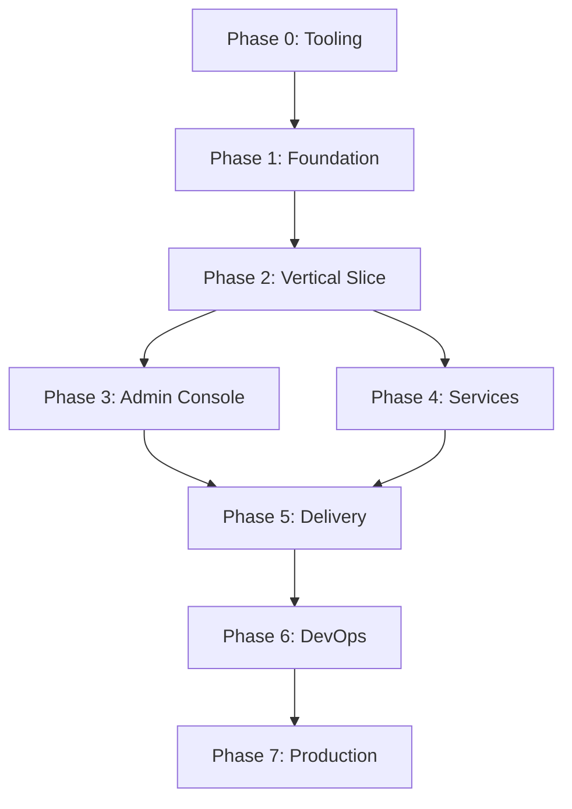

# Edition Task Tracking System

## How This Works

Each phase has a folder with numbered task files. Tasks follow this naming convention:

- `[ ]` = Not started
- `[~]` = In progress
- `[x]` = Complete

Example: `[ ] 01-initialize-repository.md` becomes `[x] 01-initialize-repository.md` when done.

## Phase Overview

```
PHASE-0-TOOLING/          ✅ Day 1
PHASE-1-FOUNDATION/       ✅ Days 2-4
PHASE-2-VERTICAL-SLICE/   ✅ Days 5-7
PHASE-3-ADMIN-CONSOLE/    ✅ Days 8-11
PHASE-4-SERVICES/         ✅ Days 12-15
PHASE-5-DELIVERY/         ✅ Days 16-19
PHASE-6-DEVOPS/          ✅ Days 20-21
PHASE-7-PRODUCTION/      ✅ Ongoing
```

## Current Status

**Active Phase**: PHASE-0-TOOLING
**Current Task**: None started
**Blockers**: None

## Quick Commands

```bash
# Check task status
find TASKS -name "*.md" | grep -E "^\[.\]" | sort

# Mark task complete
mv "TASKS/PHASE-0/[ ] 01-task.md" "TASKS/PHASE-0/[x] 01-task.md"

# Show in-progress tasks
find TASKS -name "*[~]*"

# Show blocked tasks
grep -r "BLOCKED:" TASKS/
```

## Phase Dependencies



## Tracking Rules

1. **Never skip phases** - Complete in order
2. **Block and unblock** - Add `BLOCKED: reason` to any blocked task
3. **Document decisions** - Add notes to completed tasks
4. **Update daily** - Check status every morning
5. **Review weekly** - Assess overall progress

## Success Criteria

Each phase has a `DONE.md` file that must be checked before proceeding:

- All tasks marked `[x]`
- All tests passing
- No blocked tasks
- Phase checklist complete

## The One Rule

**If the vertical slice (Phase 2) ever breaks, stop everything and fix it.**
